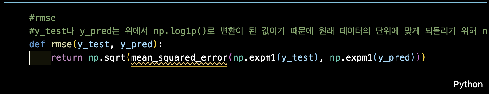
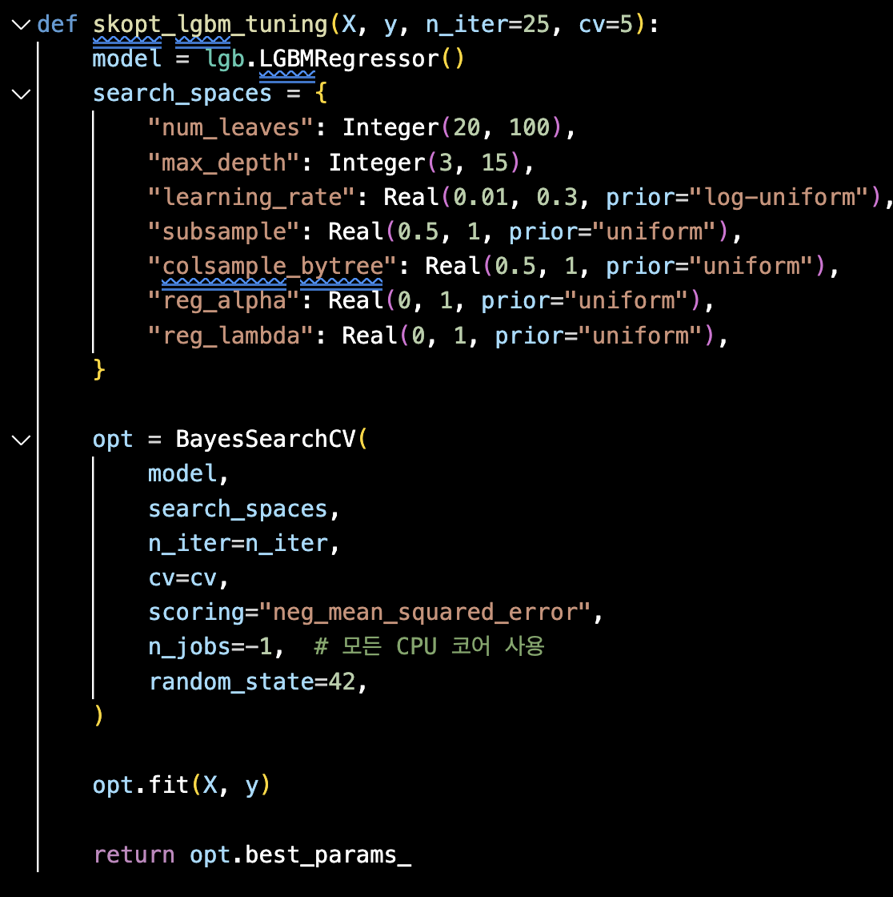

# AIFFEL Campus Online Code Peer Review Templete
- 코더 : 노하일
- 리뷰어 : 이정훈
- 작성일자 : 2024년 05월 29일

# PRT(Peer Review Template)
- [x]  **1. 주어진 문제를 해결하는 완성된 코드가 제출되었나요?**
    - 문제에서 요구하는 최종 결과물이 첨부되었는지 확인
    - 문제를 해결하는 완성된 코드란 프로젝트 루브릭 3개 중 2개, 
    퀘스트 문제 요구조건 등을 지칭
        - 해당 조건을 만족하는 코드를 캡쳐해 근거로 첨부

        ***노트북 제출 결과를 Readme에 업데이트 하셨고, 루브릭 3개 중 2개 만족***
    
- [x]  **2. 전체 코드에서 가장 핵심적이거나 가장 복잡하고 이해하기 어려운 부분에 작성된 
주석 또는 doc string을 보고 해당 코드가 잘 이해되었나요?**
    - 해당 코드 블럭에 doc string/annotation이 달려 있는지 확인
    - 해당 코드가 무슨 기능을 하는지, 왜 그렇게 짜여진건지, 작동 메커니즘이 뭔지 기술.
    - 주석을 보고 코드 이해가 잘 되었는지 확인
        - 잘 작성되었다고 생각되는 부분을 캡쳐해 근거로 첨부합니다.
        
        > *특이사항을 잘 정리하였음. PEP8 style에 대해 언급을 드렸다.*

- [x]  **3. 에러가 난 부분을 디버깅하여 문제를 “해결한 기록을 남겼거나” 
”새로운 시도 또는 추가 실험을 수행”해봤나요?**
    - 문제 원인 및 해결 과정을 잘 기록하였는지 확인
    - 문제에서 요구하는 조건에 더해 추가적으로 수행한 나만의 시도, 
    실험이 기록되어 있는지 확인
        - 잘 작성되었다고 생각되는 부분을 캡쳐해 근거로 첨부합니다.

    
    > *하이퍼 파라미터 튜닝을 위해 Bayesian Optimization을 사용 시도 하였음*

- [ ]  **4. 회고를 잘 작성했나요?**
    - 주어진 문제를 해결하는 완성된 코드 내지 프로젝트 결과물에 대해
    배운점과 아쉬운점, 느낀점 등이 기록되어 있는지 확인
    - 전체 코드 실행 플로우를 그래프로 그려서 이해를 돕고 있는지 확인
        - 잘 작성되었다고 생각되는 부분을 캡쳐해 근거로 첨부합니다.
        
- [x]  **5. 코드가 간결하고 효율적인가요?**
    - 파이썬 스타일 가이드 (PEP8) 를 준수하였는지 확인
    - 하드코딩을 하지않고 함수화, 모듈화가 가능한 부분은 함수를 만들거나 클래스로 짰는지
    - 코드 중복을 최소화하고 범용적으로 사용할 수 있도록 함수화했는지
        - 잘 작성되었다고 생각되는 부분을 캡쳐해 근거로 첨부합니다.

        

        > *불러온 패키지를 사용하는 부분을 함수화 해서 사용하였음*
        
1. 배운 점
   -  Bayesian Optimization 사용방법
3. 아쉬운 점
   - 터미널이 자주 죽어서 시간이 지체된 것이 아쉬웠음
4. 느낀 점
  - Feature 엔지니어링에 익숙해지기 위해 다른 데이터셋을 많이 경험해보는 것이 좋을 것 같다
6. 어려웠던 점
  - EDA과정에서 처음 경험한 도메인의 데이터셋이라 막막했음

 ### 캐글 Submission 스코어
 Score: 118617.27138
 Private score: 115688.21226
