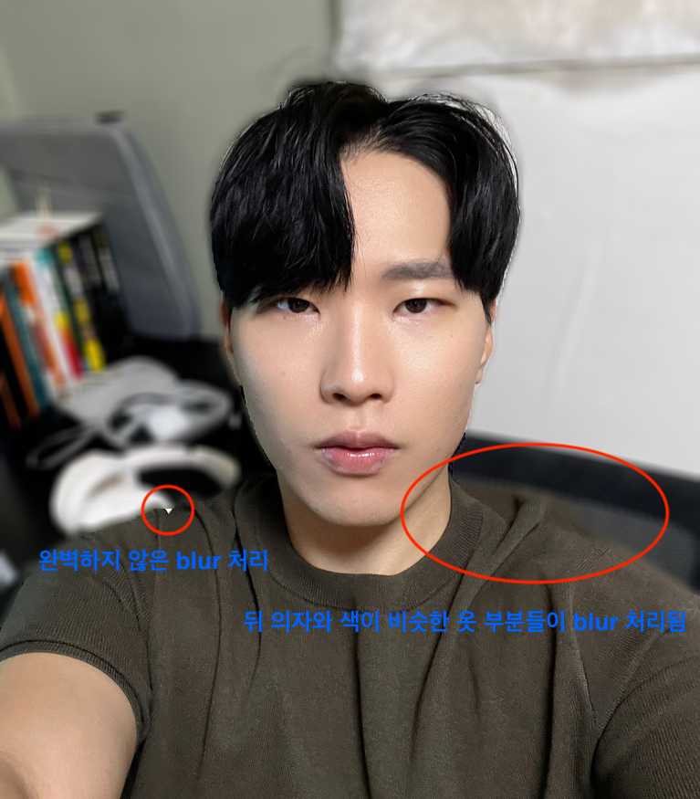
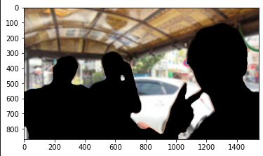
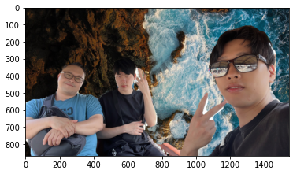
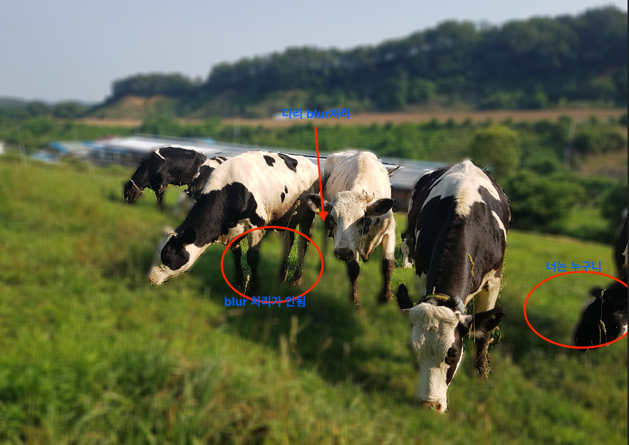
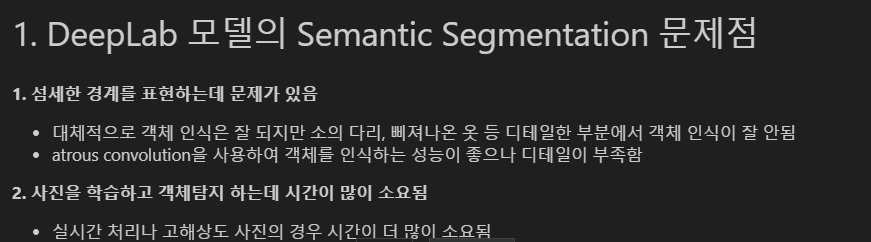
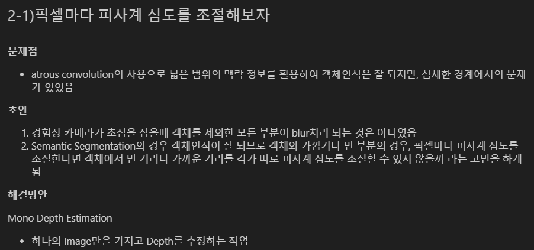
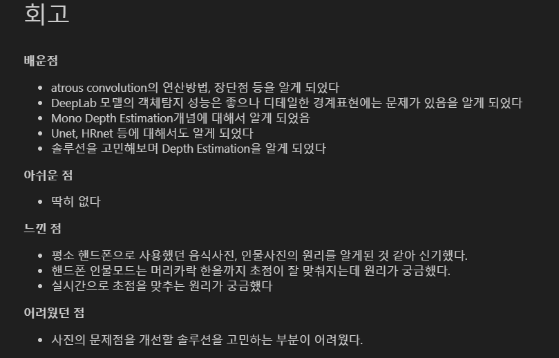

# AIFFEL Campus Online Code Peer Review Templete
- 코더 : 노하일
- 리뷰어 : 신재현

- [X]  **1. 주어진 문제를 해결하는 완성된 코드가 제출되었나요? (완성도)**
    - 문제에서 요구하는 최종 결과물이 첨부되었는지 확인
    네 폴더안의 "인물사진 만들기.ipynb"를 보시면 완성된 코드및 분석 내용들을 확인할 수 있습니다.
    또한 각 코드 블럭 안의 결과물들을 보면 프로젝트에서 원하는 블러처리 및 크로마키 그리고 여러 객체에 대한 작업들을 확인할 수 있습니다.
    - 문제를 해결하는 완성된 코드란 프로젝트 루브릭 3개 중 2개, 
    퀘스트 문제 요구조건 등을 지칭
        - 해당 조건을 만족하는 부분의 코드 및 결과물을 캡쳐하여 사진으로 첨부

    퀘스트 루브릭이 총 3가지
    1. 인물모드 사진을 성공적으로 제작하였다.
    네 밑의 결과물에서 볼 수 있듯이 성공적으로 제작하셨습니다.
    
    
    
    
    
    2. 제작한 인물모드 사진들에서 나타나는 문제점을 정확히 지적하였다.
    네 밑의 사진에서 볼 수 있듯이 각 문제점들을 그림까지 그려 설명하셨습니다.
    
    3. 인물모드 사진의 문제점을 개선할 수 있는 솔루션을 적절히 제시하였다.
    네 문제들의 솔루션들을 체계적으로 분석하셨습니다.
    

- [X]  **2. 프로젝트에서 핵심적인 부분에 대한 설명이 주석(닥스트링) 및 마크다운 형태로 잘 기록되어있나요? (설명)**
밑의 요소들은 해당사항이 없지만 각 코드들의 주석들이 체계적으로 잘 작성되어 있습니다.
    - [ ]  모델 선정 이유
    해당사항 없습니다.
    - [ ]  Metrics 선정 이유
    해당사항 없습니다.
    - [ ]  Loss 선정 이유
    해당사항 없습니다.
    여기서 사용된 코드들은 전부 LMS에서 비롯되어서 크게 따로 선정하거나의 작업은 없었습니다.

- [ ]  **3. 체크리스트에 해당하는 항목들을 모두 수행하였나요? (문제 해결)**
    - [ ]  데이터를 분할하여 프로젝트를 진행했나요? (train, validation, test 데이터로 구분)
    해당사항 없습니다.
    - [ ]  하이퍼파라미터를 변경해가며 여러 시도를 했나요? (learning rate, dropout rate, unit, batch size, epoch 등)
    해당사항 없습니다.
    - [X]  각 실험을 시각화하여 비교하였나요?
    각 결과물을 올리셨습니다.
    - [X]  모든 실험 결과가 기록되었나요?
    결과 기록 및 분석까지 있습니다.

- [X]  **4. 프로젝트에 대한 회고가 상세히 기록 되어 있나요? (회고, 정리)**
    - [X]  배운 점
    - [ ]  아쉬운 점
    - [X]  느낀 점
    - [X]  어려웠던 점
    
    각 회고들이 잘 작성되어 있습니다.